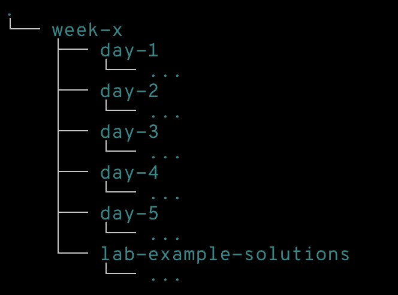

# Ironhack WebDev 804

**Hello Ironhackers!** 🥳

À partir du 08 avril 2024, nous aurons 9 semaines pour devenir Développeurs Web Full Stack 💪.

## À propos de ce repo

Ce repository doit être utilisé en tandem avec le matériel fourni dans le portail étudiant.

Dans ce repo, vous trouverez :

- Des notes.
- Des exemples.
- Des solutions types pour les labs.
- Des liens utiles et des ressources externes.

## Sommaire

- [Week 1: HTML, CSS, GIT, Flexbox, JavaScript, Testing](./week-1/README.md)
- [Week 2: OOP, Array Methods, DOM](./week-2/README.md)
- [Week 4: Node & NPM, React, React Routing](./week-4/README.md)
- [Week 5: React Hooks, Promises, APIs, Mock Backend API, and Github Collaboration](./week-5/README.md)
- [Week 7: ExpressJS, MongoDB, and Mongoose](./week-7/README.md)

- [Next Steps (After Ironhack)](./next-steps.md)

## Structure du contenu

Toutes les semaines suivent la même structure:



## Rester à jour

Ce repo est régulièrement mis à jour, alors assurez-vous de rester à jour.

Pour obtenir les dernières modifications, exécutez la commande suivante:

```sh
git pull
```

Si vous rencontrez des problèmes lors de la récupération des dernières mises à jour en raison des modifications locales, assurez-vous de `stash` avant le `pull`:

```sh
git stash
git pull
git stash pop
```
