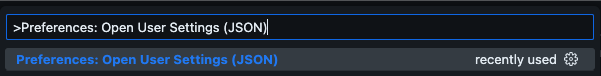

# 01. Setup

**< [Home](../../README.md) / [Week 1](../README.md)**

---

## Logiciels Requis

- VS Code
- Git
- NodeJS
- NPM
- MongoDB et MongoDB Compass

## Extensions VS Code

### Must Haves

- [Prettier](https://marketplace.visualstudio.com/items?itemName=esbenp.prettier-vscode)
- [GitLens](https://marketplace.visualstudio.com/items?itemName=eamodio.gitlens)
- [Live Server](https://marketplace.visualstudio.com/items?itemName=ritwickdey.LiveServer)
- [Live Share](https://marketplace.visualstudio.com/items?itemName=ms-vsliveshare.vsliveshare)
- [ES7+ React/Redux/React-Native snippets](https://marketplace.visualstudio.com/items?itemName=dsznajder.es7-react-js-snippets)

## Nice to Haves

- [Git Graph](https://marketplace.visualstudio.com/items?itemName=mhutchie.git-graph)
- [Better Comments](https://marketplace.visualstudio.com/items?itemName=aaron-bond.better-comments)
- [Quokka.js](https://marketplace.visualstudio.com/items?itemName=WallabyJs.quokka-vscode)
- [Excalidraw](https://marketplace.visualstudio.com/items?itemName=pomdtr.excalidraw-editor)
- [ESLint](https://marketplace.visualstudio.com/items?itemName=dbaeumer.vscode-eslint)
- [Conventional Commits](https://marketplace.visualstudio.com/items?itemName=vivaxy.vscode-conventional-commits)

## Prettier Config

1. => `Cmd + Shift + P` pour Mac, `Ctrl + Shift + P` pour Windows et Linux
2. => `>Preferences: Open User Settings (JSON)`
   
3. =>
   ```json
   {
     // Formatting Settings
     "editor.defaultFormatter": "esbenp.prettier-vscode",
     "editor.formatOnSave": true
   }
   ```
