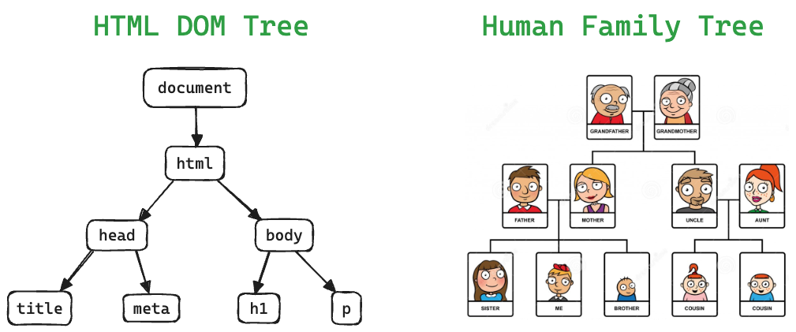
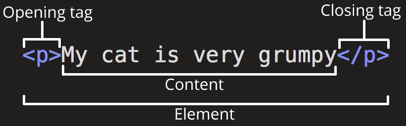
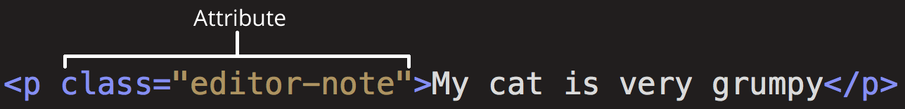
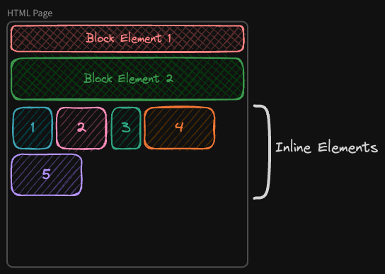

# 02. HTML Basics

**< [Home](../../README.md) / [Week 1](../README.md)**

---

## Definition

HTML stands for Hyper Text Markup Language.

Hypertext is any text that references (hyperlinks) to other text that the reader can immediately access, usually by clicking a **hyperlink**. It's a key feature of the web, allowing users to navigate through and between web pages.

## Anatomy of an HTML Document

```html
<!DOCTYPE html>
<!-- DOCTYPE declaration tells the browser how to render the document -->
<html lang="en">
  <!-- root element -->

  <head>
    <meta charset="UTF-8" />
    <meta
      name="viewport"
      content="width=device-width, initial-scale=1.0"
    />
    <title>HTML5 Introduction</title>
    <!-- webpage metadata - not visible -->
  </head>

  <body>
    <h1>Ironhackers 2024</h1>
    <p>Welcome to Ironhack!</p>
    <!-- webpage content - visible to the user -->
  </body>
</html>
```

## HTML DOM Tree



<!-- DOM Tree Hierarchy (ancestor, parent, child, descendant, sibling) -->

## Anatomy of an HTML Element



### Element Attribute



## Self-Closing Tags

An example of a self closing tag is the `` tag. In a self closing tag we rely on its attributes to use its functionality, like it is the case with the `src` attribute for images.

### A Few More Common Self-Closing Tags

- `<br />`
- `<hr />`
- `<input />`
- `<link />`
- `<meta />`

## Block vs Inline



## Typography

### Headings 1-6

```html
<h1>Heading 1</h1>
<h2>Heading 2</h2>
<h3>Heading 3</h3>
<h4>Heading 4</h4>
<h5>Heading 5</h5>
<h6>Heading 6</h6>
```

### Paragraph

```html
<p>Programming is the closest thing we have to a superpower.</p>
```

### Preformatted Text

The `<pre>` tag is used for displaying text exactly as written in the HTML file.

```html
<pre>
  H  E  L  L  O  !
    H  O  L  A
</pre>
```

### Some Common Inline Text Elements

```html
<!-- Have semantic meaning -->
<strong>Strong</strong>
<em>Emphasis</em>
<abbr title="Abbreviation">Abbr</abbr>
<kbd>Ctrl + C</kbd>

<!-- Don't have semantic meaning -->
<span>Span</span>
<b>Bold</b>
<i>Italic</i>
<s>Strikethrough</s>
<u>Underline</u>
```

## Lists

In lists the `<li>` element must be the immediate child of its parent list

### Unordered List

```html
<ul>
  <li>List Item 1</li>
  <li>List Item 2</li>
  <li>List Item 3</li>
  <li>List Item 4</li>
  <li>List Item 5</li>
</ul>
```

### Ordered List

```html
<ol>
  <li>List Item 1</li>
  <li>List Item 2</li>
  <li>List Item 3</li>
  <li>List Item 4</li>
  <li>List Item 5</li>
</ol>
```

## Table

```html
<table border="1">
  <tr>
    <th>Name</th>
    <th>Last Name</th>
    <th>Favourite Pastime</th>
  </tr>
  <tr>
    <td>Guillaume</td>
    <td>Durame</td>
    <td>Lecture</td>
  </tr>
</table>
```

## Form

```html
<form
  action="http://api.example.com/my-form"
  method="post"
>
  <!-- The label could wrap its input -->
  <label>
    Email
    <input
      name="email"
      type="email"
    />
  </label>

  <!-- Or use the `for` attribute to specify its input -->
  <label for="password">Password</label>
  <input
    name="password"
    type="password"
  />

  <input
    type="submit"
    value="Submit"
  />
</form>
```

## Grouping

### Semantic Grouping

```html
<header>
  <!-- the page's header usually contains a navbar and sometimes a search bar -->

  <nav>
    <!-- contains nav links -->
  </nav>
</header>

<main>
  <!-- contains the main content of the page -->
</main>

<aside>
  <!-- contains content that isn't relevent to it's parent. like ads for example -->
</aside>

<footer>
  <!-- the page's footer usually contains things like an about us, and contact infos-->
</footer>

<section>
  <!-- a section must have a header that acts as the section's title -->
</section>

<article>
  <!-- an article must be self contained, such as it can embeded in another page without being out of context -->
</article>
```

### Non-Semantic Grouping

When we need to group element for styling purposes or other non-semantic reasons, we should use a `div`

## Hidden Elements

These are element that do not show on the page.

- Everything that is inside the `<head>` element, like: `<meta>`, `<link>`, `<script>`
- Note that the `<script>` tag is also hidden even when it's inside the `<body>`

## External Resources

- [MDN - HTML Element Reference](https://developer.mozilla.org/en-US/docs/Web/HTML/Element)
