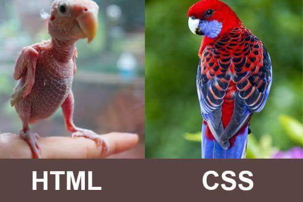
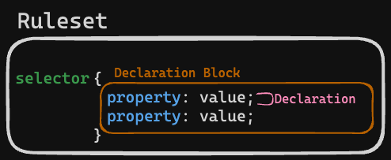

# 03. CSS Basics

**< [Home](../../README.md) / [Week 1](../README.md)**

---

## Ways of Applying Style

## Anatomy of a Rule

## Basic Selectors

- Universal
- Type
- Class
- Id

## Frequently Used Properties

- **Colors**: color, background-color
- **Sizing**: width, height
- **Fonts**: font-size, font-family, font-weight, line-height
- **Lists**: list-style
- **Text alignment**: text-align
- **Margin**: margin, margin-top, margin-bottom, margin-left, margin-right
- **Padding**: padding, padding-top, padding-bottom, etc.
- **Border**: border, border-color, border-top, border-bottom, etc.

## CSS Units

## Basic Layout and Positioning

## Specificity
