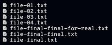
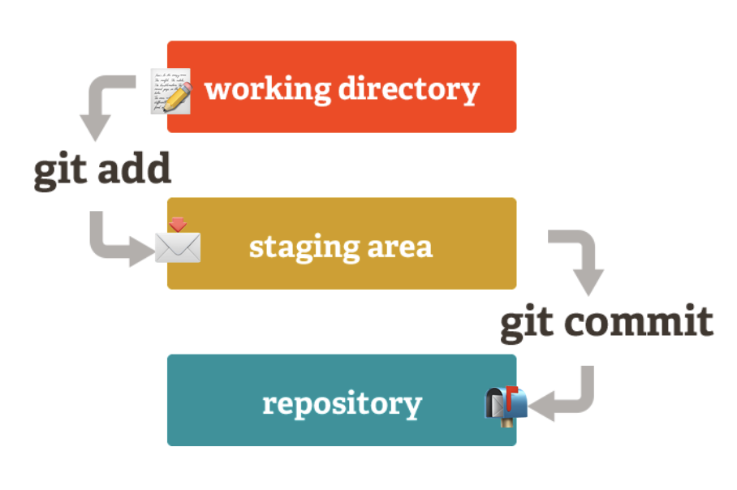

# 04. Git Basics

**< [Home](../../README.md) / [Week 1](../README.md)**

---

## What is Git

Git is a free and open source VCS software used for tracking changes in any set of files in a directory.

It is commonly used for coordinating work among programmers and collaboratively working on the code.

**OG Version Control** (Git helps us avoid this)

## Git and Github, What's the difference

**Git:** local version control system (project on your laptop).

**GitHub:** hosted version control system (project backup hosted online).

## Getting Started with Git

To start tracking changes with Git, we need to first initialize Git in an existing project (git init).

Once Git is initialized in a project, it creates a hidden folder .git which contains all the necessary files and folders Git uses to track the changes in the project.

Git tracks changes on files and manages them by using the following three main components:

- Working Directory
- Staging Area
- Repository

## How does Git Work?

- 📝 **Working Directory** is your project directory where all your files live.
- 📩 **Staging Area (index)** is where Git stores information about what will go into your next commit.
- 📬 **Repository** is where Git stores all the changes you commit.

## Git Basic Commands

- `git init` => initializes a new Git repository in the current folder.
- `git status` => shows the status of the repository including staged and unstaged changes.
- `git add .` => adds all the changes to the staging area (prepare for commit).
- `git commit -m "Commit message"` => commits all the staged changes to the local repository (Git history).
- `git push origin <branch>` => pushes the changes to the remote repository (e.g., GitHub).
- `git clone <repository_url>` => clones a repository from a remote server to your local machine.
