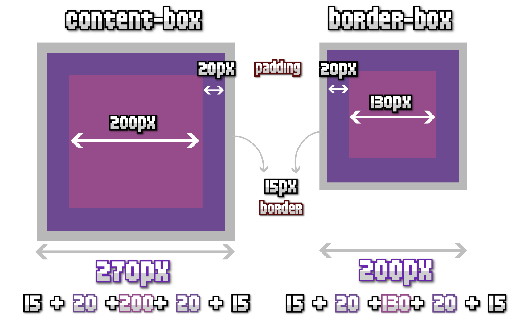

# 01. Box Model

**< [Home](../../README.md) / [Week 1](../README.md)**

---

## box-sizing

```css
.border-box {
  box-sizing: border-box;
  width: 200px;
  padding: 20px;
  border-width: 10px;
}

.content-box {
  box-sizing: content-box;
  width: 200px;
  padding: 20px;
  border-width: 10px;
}
```



## External Resources

- [Rules of Margin Collapsing](https://www.joshwcomeau.com/css/rules-of-margin-collapse/)
