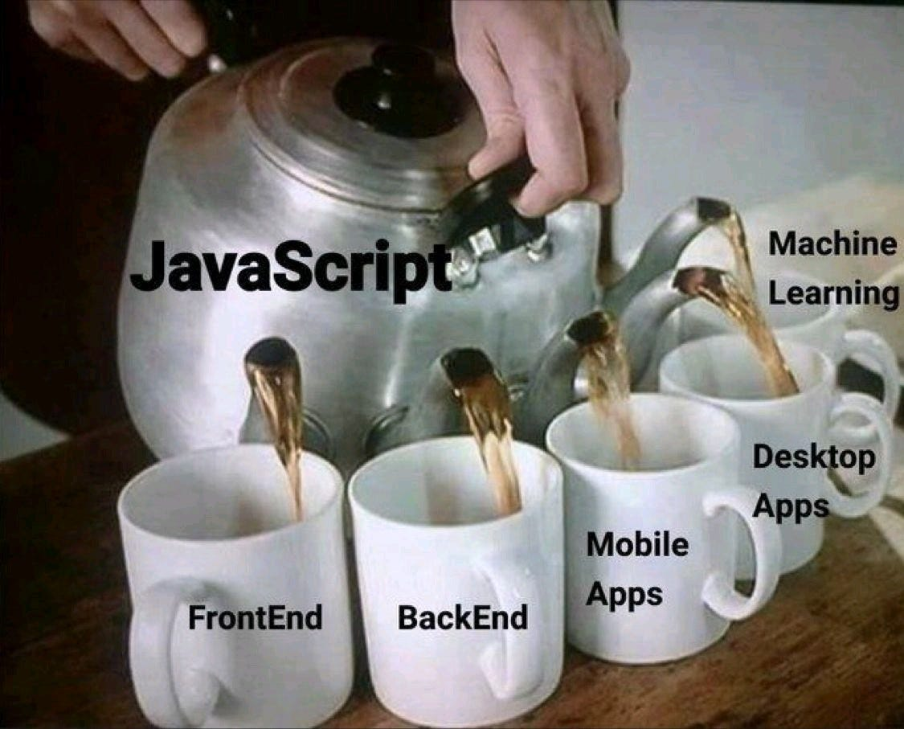

# 01. JavaScript History

**< [Home](../../README.md) / [Week 1](../README.md)**

---

# 01. JavaScript History

JavaScript is a **high-level**, **prototype-based**, **multi-paradigm**, **dynamically typed**, **interpreted** programming language. Created in 1995 by Brendan Eich while working at Netscape. The first version of JavaScript was written in 10 days and released as part of Netscape Navigator 2.0. And this is how JavaScript became the third language for web development, after HTML and CSS.

- **High-Level**: JavaScript is designed to be human-readable and easy to understand, abstracting away low-level details.
- **Prototype-Based**: JavaScript uses prototypal inheritance, where objects inherit properties and methods directly from other objects, rather than through classes as in class-based inheritance systems like Java or C++.
- **Dynamically Typed**: JavaScript does not require explicit type declarations and allows variables to hold values of different types during runtime.
- **Interpreted**: JavaScript code is executed by an interpreter at runtime, without the need for compilation beforehand.
- **Multi-Paradigm**: JavaScript supports multiple programming paradigms, including procedural, object-oriented, and functional programming.

## JScript and the Browser Wars

Microsoft, back in its full antitrust evil mode, sought to kill off competitors and dominate the web.

It released Internet Explorer 2.0 with JScript, a competitor to JavaScript which wasn't fully compatible with it.

This, naturally, presented a huge headache for developers.

Enter **ECMA**: _the European Computer Manufacturers Association_. Now known as European association for standardizing information and communication systems (catchy!), Ecma did what European associations do best: they defined standards.

## ECMAScript

1. ECMA-262, also known as ECMAScript, released in June 1997.
2. ECMAScript 2, June 1998.
3. ECMAScript 3, December 1999.
4. ECMAScript 4, widely incompatible with previous versions and criticised and thus abandoned.
5. ECMAScript 5, previously ES3.1, supposed to be an in-place improvement to ES3, released December 2009.
6. ECMAScript 6, or ES2015, the latest "living standard" version of JavaScript, released in 2015.

Since 2015, ECMAScript 7, 8 or ES2016, ES2017 etc, are incremental updates released each year.

**ECMAScript is not a language, but a standard: a specification that browsers agree to meet.**

Learn more: [EcmaScript on Wikipedia](https://en.wikipedia.org/wiki/ECMAScript)

## JavaScript Everywhere

## You don't need to know the history to use JavaScript
