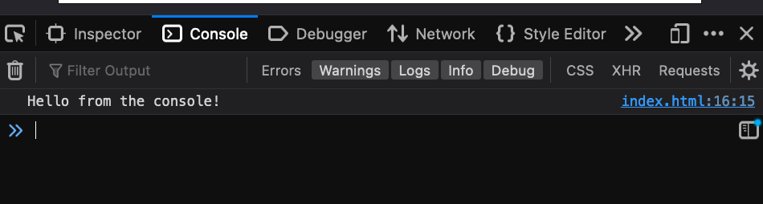

# 02. JavaScript Intro

**< [Home](../../README.md) / [Week 1](../README.md)**

---

## console.log

We can use `console.log` to print to the browser's console. This is useful for debugging and understanding what is happening in our code.

```javascript
console.log("Hello from the console!");
```



## Comments

```javascript
// This is a single line comment

/*
This is
a multi-line
comment
*/
```

## Variables

```javascript
/* var was the old way to declare variables

var name = "Yassine"; // Don't use var
name = "Senior Yassine"; // We can reassign the value of var

DON'T USE VAR
*/

const name = "Yassine";
let occupation = "Ironhacker";

// let allows us to reassign the value of a variable
occupation = "Web Developer";

// we can also reassign a value of a different type
let skill = "JavaScript";
skill = 100;
```

### Naming conventions

```javascript
// camelCase is the standard way to name things in JavaScript
const helloWorld = "Hello World";

// other naming conventions
const _underscoreAtStart = "Pour dire au autre de ne pas toucher";
const $dollarAtStart = "Common in jQuery";
const myVar1 = "Numbers are allowed at the end";
// const 2myVar = "Numbers are not allowed at the start"; // invalid

// global constant may be written in uppercase with underscores
const THE_ANSWER_TO_LIFE_THE_UNIVERSE_AND_EVERYTHING = 42;

// any unicode character is allowed
const π = 3.14;
```

## Data Types

### Primitive Data Types

All JavaScript types except Object define immutable values represented directly at the lowest level of the language. We refer to values of these types as primitive values. In JavaScript, there are 7 primitive data types:

- undefined
- null
- boolean
- number
- string
- symbol (latest added in ECMAScript2015)
- bigint (latest added in ECMAScript2020)

All primitive types, except `null`, can be tested by the `typeof` operator. `typeof null` returns `"object"`, so one has to use `=== null` to test for `null`.

All primitive types, except `null` and `undefined`, have their corresponding object wrapper types, which provide useful methods for working with the primitive values. Meaning that we can use dot notation to access properties and methods on all primitive types except `null` and `undefined`.

```javascript
undefined.property; // not possible
null.property; // not possible

undefined.method(); // not possible
null.method(); // not possible
```

Source: [MDN Web Docs](https://developer.mozilla.org/en-US/docs/Web/JavaScript/Data_structures)

**Primitive values are immutable.**

```javascript
let greeting = "Hello";
greeting[0] = "h";
console.log(greeting); // "Hello"

greeting = "Hola";
console.log(greeting); // "Hola"
```

We can reassign a variable that contains a primitive type, but we can't mutate it.

### null and undefined

`undefined` is a primitive value automatically assigned to variables that have just been declared but not initialized.
`null` is a primitive value that represents the intentional absence of any object value.

```javascript
let name;
console.log(name); // undefined

let age = null;
console.log(age); // null
```

### Strings

To declare a string, we can use single quotes `'`, double quotes `"`, or backticks `` ` ``.

```javascript
const singleQuotes = "Hello";
const doubleQuotes = "World";
const backticks = `
  Backticks allow us to write
  multi-line strings
  `;
```

```javascript
const greeting = "Hello";
const who = "World";

// concatenation
const message = greeting + " " + who; // "Hello World"

// template literals or string interpolation
const message2 = `${greeting} ${who}`; // "Hello World"
```

We can access characters in a string using bracket notation. `"Hello"[0]` will return `"H"`.

#### String Properties and Methods

- `length`: property that returns the length of a string.
- `repeat(n)`: method that returns a new string with the original string repeated `n` times.
- `slice(start, end)`: method that returns a new string from `start` to `end` (end not included).
- `substring(start, end)`: method that returns a new string from `start` to `end` (end not included).
- `startsWith(searchString)`: method that returns `true` if the string starts with `searchString`.
- `endsWith(searchString)`: method that returns `true` if the string ends with `searchString`.
- `includes(searchString)`: method that returns `true` if the string includes `searchString`.

More: [MDN Web Docs](https://developer.mozilla.org/en-US/docs/Web/JavaScript/Reference/Global_Objects/String)
