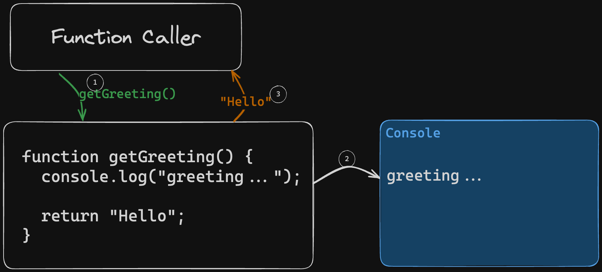

# 02. Functions

**< [Home](../../README.md) / [Week 1](../README.md)**

---

## Function Declaration and Invocation

```javascript
function someName() {
  // do some stuff
}

// function declaration
function greet() {
  console.log("Hello!");
}

// function invocation
greet(); // logs "Hello!" and returns undefined

// function declaration
function ola() {
  console.log("Ola!");

  return "Ola!";
}

// function invocation
ola(); // logs "Ola!" and returns "Ola!"
```



## Function Arguments

A function can take arguments. This is good for functions reusability.

```javascript
function greetPerson(name) {
  console.log(`Hello, ${name}!`);
}

greetPerson("John"); // logs "Hello, John!"
greetPerson("Jane"); // logs "Hello, Jane!"
```

```javascript
function add(a, b) {
  return a + b;
}

const sum = add(1, 2); // we can store the return value in a variable
console.log(sum); // logs 3

// but we can also use the return value directly
console.log(add(3, 4)); // logs 7
```

### Parameters vs Arguments

Though often used interchangeably, parameters are the variables defined in the function declaration, while arguments are the values passed to the function when it is invoked.

```javascript
function doSomething(parameter) {
  // do something with the parameter
}

doSomething(argument);
```

## Guard Clause

A guard clause is a conditional statement that checks for a specific condition and returns early if that condition is met. This is prevents the rest of the function from running when the condition is met.

```javascript
function pow(x, exp) {
  if (typeof exp !== "number") {
    // this is called a guard clause
    return x;
  }

  return x ** exp;
}
```

## Return vs Break

```javascript
const phobias = ["spiders", "heights", "planes", "darkness", "water"];

function findPhobia(toFind) {
  for (const phobia of phobias) {
    if (phobia === toFind) {
      return phobia; // returns as soon as the phobia is found
    }
  }

  // if the phobia is found, the function will return before reaching this line

  return null; // returns null if the phobia is not found
}
```

```javascript
const phobias = ["spiders", "heights", "planes", "darkness", "water"];

function findPhobia(toFind) {
  let foundPhobia = null;

  for (const phobia of phobias) {
    if (phobia === toFind) {
      break; // breaks out of the loop but not the function
    }
  }

  if (foundPhobia) {
    // do something with the found phobia
  }

  return foundPhobia;
}
```

## Multiple Return

The return statement can be used multiple times in a function. However, only one return statement will be executed. If we want to return multiple values, we can use an array.

```javascript
function getFirstAndLast(arr) {
  if (arr.length === 0) {
    return [null, null];
  }

  return [arr[0], arr[arr.length - 1]];
}
```

## Variadic Functions and The Spread Operator

A variadic function is a function that can take any number of arguments.

```javascript
function sum(...nums) {
  // nums is an array of all the arguments passed to the function
  let total = 0;

  for (const num of nums) {
    total += num;
  }

  return total;
}

sum(1, 2, 3, 4, 5); // returns 15
```

## Seperation of Concerns

We can break down a function into smaller functions. This improves readability and reusability.

```javascript
function avg(nums) {
  let total = 0;

  for (const num of nums) {
    total += num;
  }

  return total / nums.length;
}

// we can break down the avg function into smaller functions
function sum(nums) {
  let total = 0;

  for (const num of nums) {
    total += num;
  }

  return total;
}

function avg(nums) {
  return sum(nums) / nums.length;
}
```
