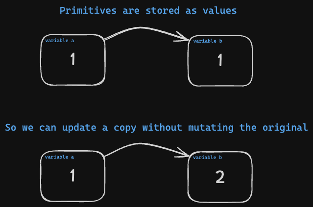
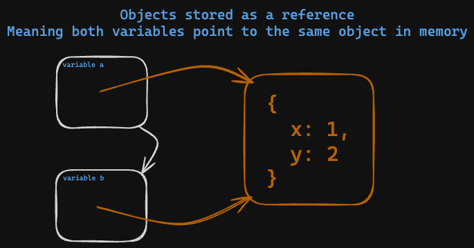
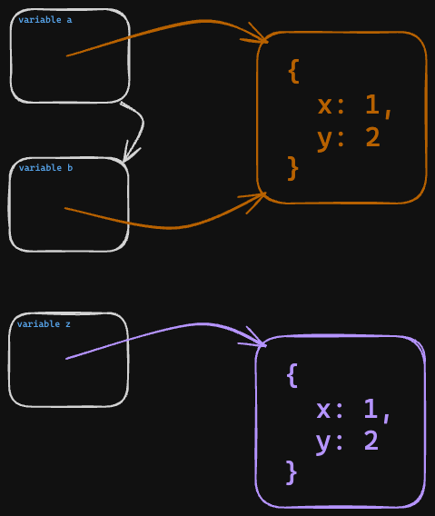

# 01. JavaScript Objects

**< [Home](../../README.md) / [Week 1](../README.md)**

---

An object is collection of key-value pairs. The keys are strings and the values can be any data type. Objects can be used to store multiple values in a single variable.

```javascript
// creating an object
const emptyObject = {};
const emptyObjectInstance = new Object(); // Not recommended

// we can also create an object with properties
const bobby = {
  firstName: "Bobby",
  lastName: "Goodman",
  hobbies: ["Tennis", "Reading", "Coding"],
  birth: {
    place: "France",
    date: "1990-01-01"
  }
};

// accessing object properties
console.log(bobby.firstName); // Bobby
console.log(bobby.lastName); // Goodman

// accessing nested object properties
console.log(bobby.birth.place); // France
console.log(bobby.birth.date); // 1990-01-01

// adding new properties
bobby.github = "robert-no-robby-no-bobby";

// updating properties
bobby.firstName = "Robert Sr.";

// deleting properties
delete bobby.github;
```

## Accessing Object Properties

### Dot Notation

```javascript
const bobby = {
  firstName: "Bobby",
  lastName: "Goodman"
};

console.log(bobby.firstName); // Bobby
console.log(bobby.lastName); // Goodman
```

### Bracket Notation

Accessing object properties using bracket notation is useful when the property name is stored in a variable. Anything we put inside the brackets is evaluated and used as the property name.

```javascript
const bobby = {
  casualFirstName: "Bobby",
  formalFirstName: "Robert",
  lastName: "Goodman"
};

console.log(bobby["casualFirstName"]); // Bobby
console.log(bobby["lastName"]); // Goodman

let whichName = "formalFirstName";
if (closeFriend) {
  whichName = "casualFirstName";
}

console.log(bobby[whichName]); // Bobby or Robert depending on the value of closeFriend
```

## Looping Through Object Properties

```javascript
const bobby = {
  firstName: "Bobby",
  lastName: "Goodman",
  hobbies: ["Tennis", "Reading", "Coding"],
  birth: {
    place: "France",
    date: "1990-01-01"
  }
};

for (let key in bobby) {
  console.log(key, bobby[key]);
}

// Logs
// firstName Bobby
// lastName Goodman
// hobbies [ 'Tennis', 'Reading', 'Coding' ]
// birth { place: 'France', date: '1990-01-01' }
```

## Object Methods

### Object.keys()

The `Object.keys()` method returns an array of a given object's own enumerable property names, in the same order as we get with a normal loop.

```javascript
const bobby = {
  firstName: "Bobby",
  lastName: "Goodman",
  favPastime: "Coding"
};

console.log(Object.keys(bobby)); // [ 'firstName', 'lastName', 'favPastime' ]
```

### Object.values()

The `Object.values()` method returns an array of a given object's own enumerable property values, in the same order as we get with a normal loop.

```javascript
const bobby = {
  firstName: "Bobby",
  lastName: "Goodman",
  favPastime: "Coding"
};

console.log(Object.values(bobby)); // [ 'Bobby', 'Goodman', 'Coding' ]
```

### Value vs Reference

When we store an object in a variable, we are actually storing a reference to the object in memory.

```javascript
const a = 1;
let b = a;

b = 2;

console.log(b); // 2
console.log(a); // 1
```



```javascript
const a = {
  x: 1,
  y: 2
};

const b = a;

b.x = 4;

console.log(b); // { x: 4, y: 2 }
console.log(a); // { x: 4, y: 2 }
```



`obj1 === obj2` is only `true` if both variables are pointing to the same object in memory.

```javascript
const a = {
  x: 1,
  y: 2
};

const b = a;

const z = {
  x: 1,
  y: 2
};

console.log(b === a); // true
console.log(z === a); // false
console.log(z === b); // false
```



## Accessing a Deeply Nested Property

```javascript
const schoolSystem = {
  schools: [
    {
      name: "Fake School 1",
      classRooms: [
        {
          teacher: { firstName: "Marcelino", lastName: "Padberg", age: 25 },
          students: [
            { firstName: "Aliyah", lastName: "Schulist", age: 18 },
            { firstName: "Cleveland", lastName: "Towne", age: 28 },
            { firstName: "Jan", lastName: "Quitzon", age: 18 },
            { firstName: "Alaina", lastName: "Runolfsdottir", age: 18 },
            { firstName: "Gerhard", lastName: "Bergstrom", age: 23 }
          ]
        },
        {
          teacher: { firstName: "Edwardo", lastName: "Schowalter", age: 28 },
          students: [
            { firstName: "Manley", lastName: "Doyle", age: 18 },
            { firstName: "Maximilian", lastName: "Gleichner", age: 19 },
            { firstName: "Sid", lastName: "Rohan", age: 30 },
            { firstName: "Catalina", lastName: "Hilpert", age: 27 },
            { firstName: "Gerald", lastName: "O'Keefe", age: 26 }
          ]
        }
      ]
    },
    {
      name: "Fake School 2",
      classRooms: [
        {
          teacher: { firstName: "Lucas", lastName: "Schroeder", age: 29 },
          students: [
            { firstName: "Giuseppe", lastName: "Hegmann", age: 24 },
            { firstName: "Jennyfer", lastName: "Hane", age: 19 },
            { firstName: "Mikayla", lastName: "Braun", age: 23 },
            { firstName: "Rickie", lastName: "White", age: 22 },
            { firstName: "Rose", lastName: "Collins", age: 30 }
          ]
        },
        {
          teacher: { firstName: "Green", lastName: "Sauer", age: 25 },
          students: [
            { firstName: "Melany", lastName: "Welch", age: 25 },
            { firstName: "Paxton", lastName: "Corkery", age: 22 },
            { firstName: "Nellie", lastName: "Hauck", age: 26 },
            { firstName: "Eunice", lastName: "Hirthe", age: 26 },
            { firstName: "Aylin", lastName: "Barrows", age: 26 }
          ]
        }
      ]
    }
  ]
};

console.log(schoolSystem.schools[0].classRooms[0].students[1].firstName); // Cleveland
```

## Using Objects

```javascript
const characters = [
  {
    name: "Bob",
    distinctFeat: "Have a glorious mustache",
    favHoliday: "Thanksgiving",
    superPowers: ["Making burgers", "Mean stare"]
  },
  {
    name: "Linda",
    distinctFeat: "Wear glasses",
    favHoliday: "Christmas",
    superPowers: ["Singing like an angel", "Epic knitting skills"]
  }
];

function presentSelf(identity) {
  // const str = identity.superPowers.toString().replace(",", ", ");
  // console.log(str);

  // let powers = "";
  // for (let i = 0; i < identity.superPowers.length; i++) {
  //   powers += identity.superPowers[i];

  //   if (i < identity.superPowers.length - 1) {
  //     powers += ", ";
  //   }
  // }

  const powersAsString = identity.superPowers.join(", ");

  return `Hi, my name is ${identity.name}, I ${identity.distinctFeat}, my favourite holiday is ${identity.favHoliday}, and my superpowers are: ${powersAsString}.`;
}

function presentAllCharacters() {
  for (const char of characters) {
    console.log(presentSelf(char));
  }
}

presentAllCharacters();
// Logs
// Hi, my name is Bob, I have a glorious mustache, my favourite holiday is Thanksgiving, and my superpowers are: Making burgers, Mean stare.

// Hi, my name is Linda, I wear glasses, my favourite holiday is Christmas, and my superpowers are: Singing like an angel, Epic knitting skills.
```
