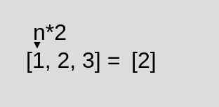

# 02. Array Methods

**< [Home](../../README.md) / [Week 2](../README.md)**

---

## forEach()

### Callback Signature

```javascript
(currentElement, currentIndex, array) => void
```

### Example

```javascript
const result = [1, 2, 3].forEach((x) => console.log(x));

// logs: 1, 2, 3
// result === undefined
```

### `for` et `forEach`

```javascript
const doSomething = (x) => {
  /*...*/
};

const numbers = [1, 2, 3];

//  for
for (let i = 0; i < numbers.length; i++) {
  doSomething(numbers[i]);
}

// Array.forEach
numbers.forEach(doSomething);
// numbers.forEach((x) => {/*...*/});
```

### Implementation

We pass the array as the first argument, because in this implementation `forEach` is function and not a method of the array object.

```javascript
function forEach(arr, callback) {
  for (let i = 0; i < arr.length; i++) {
    callback(arr[i], i, arr);
  }
}
```

## map()

### Callback Signature

```javascript
(currentElement, currentIndex, array) => mappedElement;
```

### Example

```javascript
const result = [1, 2, 3].map((x) => x * 2);

console.log(result); // [2, 4, 6]
```



### Implementation

```javascript
function map(arr, callback) {
  const newArr = [];

  for (let i = 0; i < arr.length; i++) {
    newArr.push(callback(arr[i], i, arr));
  }

  return newArr;
}
```

## filter(), find(), findIndex(), findLast(), findLastIndex()

### Callback Signature

```javascript
(currentElement, currentIndex, array) => boolean;
```

### Example

```javascript
const filtered = [1, 2, 3, 4, 5].filter((x) => x % 2 === 0);
console.log(filtered); // [2, 4]

const found = ["dinosaur", "koala", "cat", "elephant", "dog"].find(
  (x) => x.length === 3
);
console.log(found); // "cat"

const foundIndex = ["dinosaur", "koala", "cat", "elephant", "dog"].findIndex(
  (x) => x.length === 3
);
console.log(foundIndex); // 2

const foundLast = ["dinosaur", "koala", "cat", "elephant", "dog"].findLast(
  (x) => x.length === 3
);
console.log(foundLast); // "dog"

const foundLastIndex = [
  "dinosaur",
  "koala",
  "cat",
  "elephant",
  "dog"
].findLastIndex((x) => x.length === 3);
console.log(foundLastIndex); // 4
```

### Implementation

```javascript
function filter(arr, callback) {
  const filtered = [];

  for (let i = 0; i < arr.length; i++) {
    const meetsRequirement = callback(arr[i], i, arr);

    if (meetsRequirement) {
      filtered.push(arr[i]);
    }
  }

  return filtered;
}

function find(arr, callback) {
  for (let i = 0; i < arr.length; i++) {
    const isFound = callback(arr[i], i, arr);

    if (isFound) {
      return arr[i];
    }
  }

  // no need to return undefined since it's implicit
  // return undefined
}

function findIndex(arr, callback) {
  for (let i = 0; i < arr.length; i++) {
    const isFound = callback(arr[i], i, arr);

    if (isFound) {
      return i;
    }
  }

  return -1;
}

function findLast(arr, callback) {
  for (let i = arr.length - 1; i >= 0; i--) {
    const isFound = callback(arr[i], i, arr);

    if (isFound) {
      return i;
    }
  }

  // no need to return undefined since it's implicit
  // return undefined
}

function findLastIndex(arr, callback) {
  for (let i = arr.length - 1; i >= 0; i--) {
    const isFound = callback(arr[i], i, arr);

    if (isFound) {
      return i;
    }
  }

  return -1;
}
```

## reduce()

### Callback Signature

```javascript
(accumulator, currentElement, currentIndex, array) => newAccumulator;
```

### Example

```javascript
const totalNums = [1, 2, 3, 4, 5].reduce((acc, x) => acc + x);
console.log(totalNums); // 15

const strArr = ["Hello", "Bye", "Ola", null, undefined, "Maybe", {}, "Later"];

const reducedStrs = strArr.reduce((acc, curr) => {
  // if (typeof curr === "string") {
  //   return acc + curr;
  // } else {
  //   return acc;
  // }

  return typeof curr === "string" ? acc + curr : acc;
});
console.log(reducedStrs); // "HelloByeOlaMaybeLater"

const reducedStrs2 = strArr.reduce((acc, curr) => {
  return typeof curr === "string" ? acc + curr : acc;
}, "Something");

console.log(reducedStrs2); // "SomethingHelloByeOlaMaybeLater"
```

### Implementation

```javascript
function reduce(arr, callback, initialAccumulator) {
  let acc = initialAccumulator;
  let i = 0;

  if (initialAccumulator === undefined) {
    acc = arr[0];
    i = 1;
  }

  while (i < arr.length) {
    acc = callback(acc, arr[i], i, arr);

    i++;
  }

  return acc;
}
```

## reverse(), toReversed()

`reverse()` takes no arguments and mutates the original array by reversing the order of its elements.

### Example

```javascript
const numbers = [1, 2, 3, 4, 5];

const reversed = numbers.reverse();

console.log(reversed); // [5, 4, 3, 2, 1]
console.log(numbers); // [5, 4, 3, 2, 1]
```

If we don't want reverse to mutate our original array, we can first create a shallow copy of it. Using the `slice` method or the spread operator.

```javascript
const ogNumbers = [1, 2, 3, 4, 5];

// shallow copy using the slice method
const clonedNumbers1 = ogNumbers.slice();
clonedNumbers1.reverse();

// shallow copy using the spread operator
const clonedNumbers2 = [...ogNumbers];
clonedNumbers2.reverse();

console.log(ogNumbers); // [1, 2, 3, 4, 5]
console.log(clonedNumbers1); // [5, 4, 3, 2, 1]
console.log(clonedNumbers2); // [5, 4, 3, 2, 1]
```

### Implementation

```javascript
function reverse(arr) {
  let i = 0;
  let j = arr.length - 1;

  while (i < j) {
    const temp = arr[i];

    arr[i] = arr[j];
    arr[j] = temp;

    i++;
    j--;
  }

  return arr;
}
```

**`Array.toReversed` works exactly like reverse() does, except it returns a new array instead of mutating the original**

## sort(), toSorted()

### Callback Signature

```javascript
(a, b) => number;
```

- `number === 0`: maintain the original order of `a` and `b`
- `number > 0`: `a` after `b`, e.g. `[b, a]`
- `number < 0`: `a` before `b`, e.g. `[a, b]`

### Exemple

```javascript
["March", "Jan", "Feb", "Dec"].sort();
// mutates and returns the original array: ["Dec", "Feb", "Jan", "March"]

["Ulysse", "Claire", "Yassine", "Marie", "Guillaume"].sort((a, b) =>
  a.localeCompare(b)
);
// mutates and return the original array: ["Claire", "Guillaume", "Marie", "Ulysse", "Yassine"]

["Ulysse", "Claire", "Yassine", "Marie", "Guillaume"].sort((a, b) =>
  b.localeCompare(a)
);
// mutates and return the original array: ["Yassine", "Ulysse", "Marie", "Guillaume", "Claire"]

// sorts default behavior is to convert elements to strings and compare them
[1, 2, 3, 4, 5, 11, 22, 33].sort();
// mutates and returns the original array: [1, 11, 2, 22, 3, 33, 4, 5]

[1, 2, 3, 4, 5, 11, 22, 33].sort((a, b) => a - b);
// mutates and returns the original array: [1, 2, 3, 4, 5, 11, 22, 33]

[1, 2, 3, 4, 5, 11, 22, 33].sort((a, b) => b - a);
// mutates and returns the original array: [33, 22, 11, 5, 4, 3, 2, 1]
```

If we don't want sort to mutate our original array, we can first create a shallow copy of it. Using the `slice` method or the spread operator.

```javascript
const ogMonths = ["March", "Jan", "Feb", "Dec"];

// shallow copy using the slice method
const clonedMonths1 = ogMonths.slice();
clonedMonths1.sort();

// shallow copy using the spread operator
const clonedMonths2 = [...ogMonths];
clonedMonths2.sort();

console.log(ogMonths); // ["March", "Jan", "Feb", "Dec"]
console.log(clonedMonths1); // ["Dec", "Feb", "Jan", "March"]
console.log(clonedMonths2); // ["Dec", "Feb", "Jan", "March"]
```

**`Array.toSorted` works exactly like sort() does, except it returns a new array instead of mutating the original**

## every(), some()

### Callback Signature

```javascript
(currentElement, currentIndex, array) => boolean;
```

### Example

```javascript
const isEveryElementGreaterThanTwo = [1, 2, 3, 4, 5].every((x) => x > 2);
console.log(isEveryElementGreaterThanTwo); // false

const isEveryElementLessThanSix = [(1, 2, 3, 4, 5)].every((x) => x < 6);
console.log(isEveryElementLessThanSix); // true

const areSomeElementsGreaterThanTwo = [(1, 2, 3, 4, 5)].some((x) => x > 2);
console.log(areSomeElementsGreaterThanTwo); // true
```
