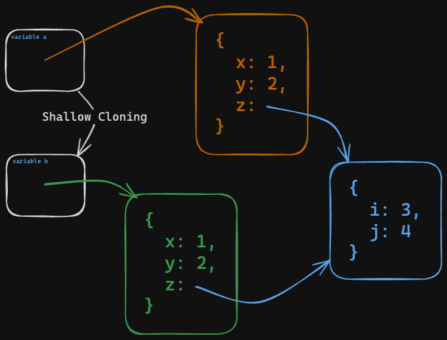

# 02. Value vs Reference

**< [Home](../../README.md) / [Week 2](../README.md)**

---

## [Refer Back to W1D5-JS-Objects](../../week-1/day-5/01.javascript-objects.md#value-vs-reference)

## Shallow Copy

```javascript
const a = {
  x: 1,
  y: 2
  z: {
    i: 3,
    j: 4
  }
};

const b = { ...a };

b.x = 4;

console.log(b); // { x: 4, y: 2, z: { i: 3, j: 4 } }
console.log(a); // { x: 1, y: 2, z: { i: 3, j: 4 } }


b.z.i = 5;

console.log(b); // { x: 4, y: 2, z: { i: 5, j: 4 } }
console.log(a); // { x: 1, y: 2, z: { i: 5, j: 4 } }
```

When we create a shallow copy of an object or an array, we are copying all its properties or elements. For primitive properties/elements, the value is copied. For everything else (ie. objects, arrays, functions), the reference is copied.



## Deep Copy

```javascript
const a = {
  x: 1,
  y: 2
  z: {
    i: 3,
    j: 4
  }
};

const b = JSON.parse(JSON.stringify(a));

b.x = 4;

console.log(b); // { x: 4, y: 2, z: { i: 3, j: 4 } }
console.log(a); // { x: 1, y: 2, z: { i: 3, j: 4 } }

b.z.i = 5;

console.log(b); // { x: 4, y: 2, z: { i: 5, j: 4 } }
console.log(a); // { x: 1, y: 2, z: { i: 3, j: 4 } }
```

- `JSON.stringify` converts our object to a string, which is a primitive, and therefore copied by value.
- `JSON.parse` then converts the string back to an object, creating an entirely new object in the process.

### `structuredClone`

```javascript
const a = {
  x: 1,
  y: 2
  z: {
    i: 3,
    j: 4
  }
};

const b = structuredClone(a);

b.x = 4;

console.log(b); // { x: 4, y: 2, z: { i: 3, j: 4 } }
console.log(a); // { x: 1, y: 2, z: { i: 3, j: 4 } }

b.z.i = 5;

console.log(b); // { x: 4, y: 2, z: { i: 5, j: 4 } }
console.log(a); // { x: 1, y: 2, z: { i: 3, j: 4 } }
```

**`structuredClone` is fairly new global function to deep clone objects. It has decent browser support, but if not use the `JSON.parse(JSON.stringify(obj))` method.**
