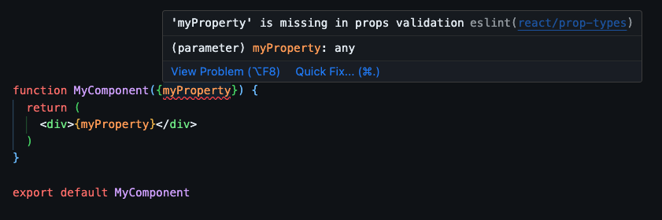
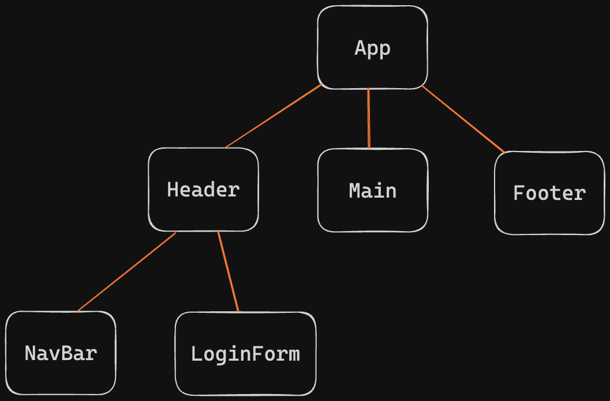
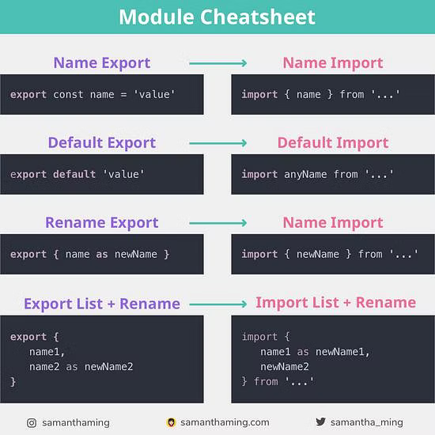

# 01. React Introduction

**< [Home](../../README.md) / [Week 4](../README.md)**

---

## Starting a React Project with Vite

In the terminal, run the following commands to create a new React project using Vite.

### 1. Create Project

```sh
npm create vite@latest <project-name> -- --template react
```

OR

```sh
npm create vite@latest

# 1. Type the project name
# 2. Select the template (React)
# 3. Select the variant (JavaScript)
```

### 2. Install Dependencies

```sh
cd <project-name>  # go to the project directory
npm install        # install dependencies
```

### 3. Start Development Server

```sh
npm run dev  # to be run in the project directory
```

### 4. ESLint react/prop-types Validation Error



If you have the following ESLint error when destructuring props, you can add the following rule `"react/prop-types": "off"` to the `.eslintrc` file to disable the prop-types validation.

**Here is an example of the `.eslintrc` file:**

```javascript
module.exports = {
  root: true,
  env: { browser: true, es2020: true },
  extends: [
    "eslint:recommended",
    "plugin:react/recommended",
    "plugin:react/jsx-runtime",
    "plugin:react-hooks/recommended"
  ],
  ignorePatterns: ["dist", ".eslintrc.cjs"],
  parserOptions: { ecmaVersion: "latest", sourceType: "module" },
  settings: { react: { version: "18.2" } },
  plugins: ["react-refresh"],
  rules: {
    "react/prop-types": "off", // disable prop-types validation
    "react/jsx-no-target-blank": "off",
    "react-refresh/only-export-components": [
      "warn",
      { allowConstantExport: true }
    ]
  }
};
```

## React

### JSX

- JSX stands for JavaScript XML.
- JSX allows us to write HTML in React.

**Vite relies on Babel to transpile JSX code into JavaScript.**

```jsx
import "./App.css"; // this loads the CSS file

// this is a function that returns JSX
function msg(name) {
  return <p>Nice to meet you, {name}!</p>;
}

// this is a functional component
// function Message(props) {
//   return <p>Nice to meet you, {props.name}!</p>;
// }

// we can destructure the props of a functional component
function Message({ name }) {
  return <p>Nice to meet you, {name} !</p>;
}

// we use PascalCase for component names
function SpecialMessage(props) {
  return (
    <div>
      <p>
        {props.messageContent}, fancy seeing you here in {props.year}
      </p>

      {props.children}
    </div>
  );
}

function App() {
  const greeting = "Ola";

  return (
    <div className="class-is-reserved-in-js">
      {/* this is how we comment in JSX */}
      {/* <p>Commment me</p> */}

      <h1>{greeting}</h1>

      {console.log("anything between curly braces is JavaScript")}
      <p>The result will be render {2 + 2}</p>

      {/* we can even call a function that returns JSX (but don't) */}
      {msg("Yassine")}
      {msg("Marie")}

      {/* we can pass props to a component */}
      <Message name="Ulysse" />

      {/* components must start with a capital letter, otherwise they are considered as html and won't work */}
      {/* <message name="Ulysse" /> This won't work*/}

      {/* a component can have children elements/components */}
      {/* these children can be accessed through props.children */}
      <SpecialMessage
        messageContent="Greetings"
        year={2024}
      >
        <div>Claire</div>
        <div>Guillaume</div>
        <div>CSS</div>
      </SpecialMessage>
    </div>
  );
}
```

### JSX Fragments

A react component must return one element and one element only. So when we need to return multiple elements and don't want to wrap them in a `<div>` or any other element, we can use a JSX fragment.

```jsx
return (
  <React.Fragment>
    <h1>Greetings</h1>
    <p>We come in peace</p>
  </React.Fragment>
);
```

Or

```jsx
return (
  <>
    <h1>Greetings</h1>
    <p>We come in peace</p>
  </>
);
```

### React Component Tree

While the DOM tree contains HTML elements, The React component tree contains React components.

```jsx
function App() {
  return (
    <div>
      <Header />
      <Main />
      <Footer />
    </div>
  );
}

function Header() {
  return (
    <header>
      <NavBar />
      <LoginForm />
    </header>
  );
}
```



## ES Modules



**[Full ES Modules Cheatsheet by Samantha Ming](https://www.samanthaming.com/tidbits/79-module-cheatsheet)**
