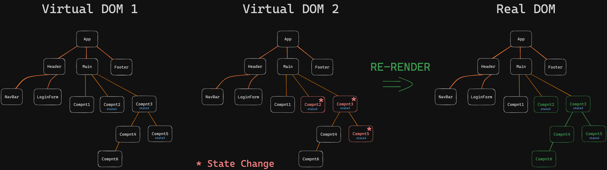

# 01. React State

**< [Home](../../README.md) / [Week 4](../README.md)**

---

```jsx
function App() {
  let count = 0;

  return (
    <>
      <h1>{count}</h1>

      <button
        onClick={() => {
          count++;
          console.log("count is: ", count);
        }}
      >
        Increment
      </button>
    </>
  );
}
```

In the above code `count` is incremented when the button is clicked, but the displayed value remains the same. Because React doesn't know that the value of `count` has changed. To make React aware of the change, we need to use `state`.

## `useState`

```jsx
import { useState } from "react";

function App() {
  const [count, setCount] = useState(0);

  return (
    <>
      <h1>{count}</h1>

      <button
        onClick={() => {
          /* => Mutating the state directly is an anti-pattern (AVOID)
          setCount(++count); // NEVER THIS
          */

          setCount(count + 1);
        }}
      >
        Increment
      </button>
    </>
  );
}
```

`useState` is a special function provided by React also known as a hook (all React hooks start with `use`). It takes an initial value and returns an array with two elements. The first element is the current value of the state and the second element is a function that can be used to update the state.

When calling `setCount` with new value, the value of `count` is updated and the component is re-rendered.

**CAUTION: Never modify the state directly**

**NOTE: When `setState` is called with the same old value, React doesn't re-render the component.**

```jsx
import { useState } from "react";

function App() {
  const [greeting, setGreeting] = useState("Ola");

  return (
    <>
      <h1>{greeting}</h1>

      <button
        onClick={() => {
          // Because newValue === oldValue, we can click the button as much as we like and the component won't re-render
          setGreeting("Ola");
        }}
      >
        Update Greeting
      </button>
    </>
  );
}
```

## Virtual DOM

To keep the UI in sync with the state, React uses a concept called Virtual DOM. When the state changes, React creates a new Virtual DOM and compares it with the old Virtual DOM. If there are any differences, React updates the real DOM.



**A state change triggers a re-render of the component and all its children, whether or not that state is used in the child component. This is why it's important to keep the state as close to the component that uses it as possible.**
