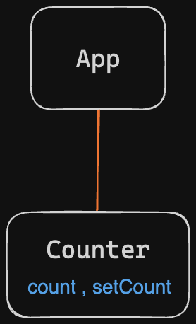
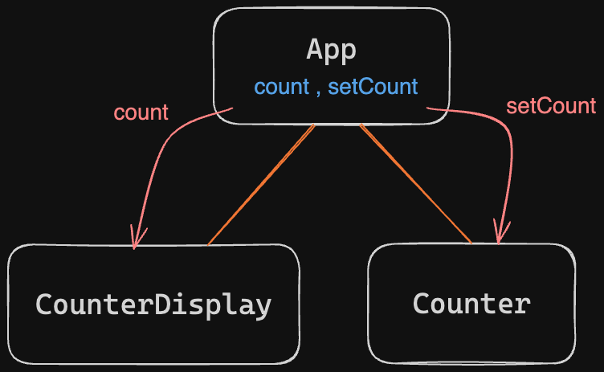

# 01. React State Lifting

**< [Home](../../README.md) / [Week 4](../README.md)**

---

## What is State Lifting?

State lifting is the process of moving the state of a component to a higher level in the component hierarchy, like a parent component for example. This is done to share the state between multiple components.

## When Do We Lift State?

Let's assume we have an `App` component that contains a `Counter` component. The `Counter` component has a state that keeps track of the count.



```jsx
// App.jsx

function App() {
  return (
    <div>
      <Counter />
    </div>
  );
}
```

```jsx
// Counter.jsx

function Counter() {
  const [count, setCount] = useState(0);

  return (
    <div>
      <p>{count}</p>
      <button onClick={() => setCount(count + 1)}>Increment</button>
      <button onClick={() => setCount(count - 1)}>Decrement</button>
    </div>
  );
}
```

Now, let's say we want to use another component called `CounterDisplay` to display the count in the `App`. In the above scenario, `CounterDisplay` would not have access to the `count` state because it is local to the `Counter` component.

So, to share the `count` state between the `Counter` and `CounterDisplay` components, we need to lift the state up to the `App` component. Then, we can pass the `count` state and the `setCount` function as props to the `CounterDisplay` and `Counter` components respectively.



```jsx
// App.jsx

function App() {
  const [count, setCount] = useState(0);

  return (
    <div>
      <Counter setCount={setCount} />
      <CounterDisplay count={count} />
    </div>
  );
}
```

```jsx
// CounterDisplay.jsx

function CounterDisplay({ count }) {
  return (
    <div>
      <p>Count: {count}</p>
    </div>
  );
}
```

```jsx
// Counter.jsx

function Counter({ setCount }) {
  return (
    <div>
      <button onClick={() => setCount(count + 1)}>Increment</button>
      <button onClick={() => setCount(count - 1)}>Decrement</button>
    </div>
  );
}
```
