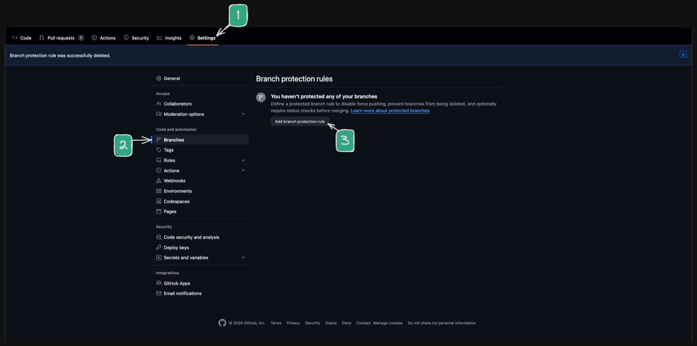
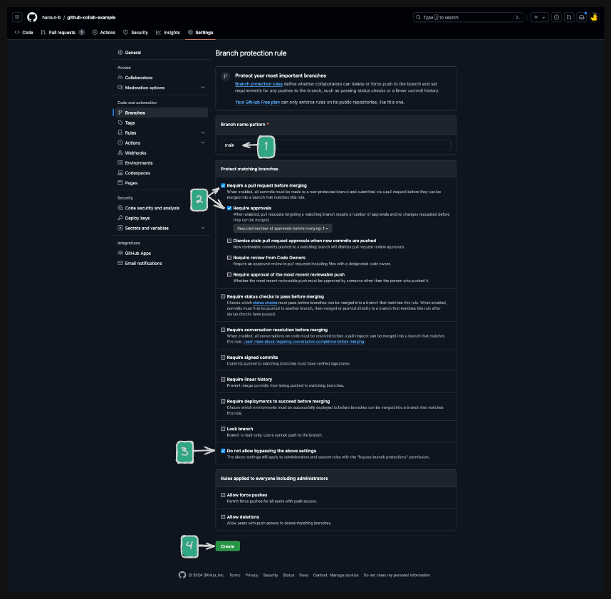

# 01. GitHub Collaboration

**< [Home](../../README.md) / [Week 5](../README.md)**

---

## Protecting the `main` Branch

When working with a team, it's important to protect the `main` branch from accidental changes. This can be done by setting up branch protection rules on GitHub.

**The `main` should only be updated through pull requests. And should only contain working code.**

To protect the `main` branch:

### Step 1

### Step 2

